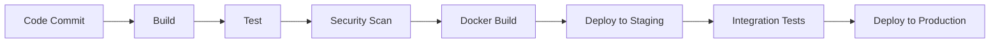

# gayaProdSystem - Technical Architecture

**Author:** BMad
**Date:** 2025-11-11
**Version:** 1.0

---

## Overview

This document outlines the technical architecture for gayaProdSystem, a comprehensive enterprise web application for ceramic craft production management. The system transforms artisanal ceramic production from manual processes into a data-driven enterprise platform with real-time tracking, stock management, and multi-user collaboration.

## System Architecture

I would like Core framework :
Next.js@latest (Backend & Frontend)
TypeScript 5
Tailwind CSS
UI Components & Styling
shadcn/ui
Lucide React
Framer Motion
Next Themes
React Hook Form
Zod - TypeScript-first schema validation
State Management & Data Fetching
Zustand - Simple, scalable state management
TanStack Query - Powerful data synchronization for React
Axios - Promise-based HTTP client
Database & Backend
Prisma - Next-generation Node.js and TypeScript ORM
NextAuth.js - Complete open-source authentication solution
Advanced UI Features
TanStack Table - Headless UI for building tables and datagrids
DND Kit - Modern drag and drop toolkit for React
Recharts - Redefined chart library built with React and D3
Sharp - High performance image processing
Internationalization & Utilities
Next Intl - Internationalization library for Next.js
Date-fns - Modern JavaScript date utility library
ReactUse - Collection of essential React hooks for modern development
Why This Scaffold?
Fast Development - Pre-configured tooling and best practices
Beautiful UI - Complete shadcn/ui component library with advanced interactions
Type Safety - Full TypeScript configuration with Zod validation
Responsive - Mobile-first design principles with smooth animations
Database Ready - Prisma ORM configured for rapid backend development
Auth Included - NextAuth.js for secure authentication flows
Data Visualization - Charts, tables, and drag-and-drop functionality
i18n Ready - Multi-language support with Next Intl
Production Ready - Optimized build and deployment settings
AI-Friendly - Structured codebase perfect for AI assistance

## Database Architecture

### PostgreSQL Schema Design

#### Existing Tables (Migrated from MySQL)

```sql
-- Core collection tables (migrated from gayafusionall schema)
CREATE TABLE tblcollect_master (
    id SERIAL PRIMARY KEY,
    collect_code VARCHAR(15) UNIQUE NOT NULL, -- Master product code
    assembly_code VARCHAR(15), -- Assembly product code for sets and non-ceramic materials
    design_code VARCHAR(2) NOT NULL,
    name_code VARCHAR(2) NOT NULL,
    category_code VARCHAR(3) NOT NULL,
    size_code VARCHAR(2) NOT NULL,
    texture_code VARCHAR(2) NOT NULL,
    color_code VARCHAR(3) NOT NULL,
    material_code VARCHAR(2) NOT NULL,
    client_code VARCHAR(20),
    client_description VARCHAR(50),
    collect_date DATE DEFAULT '0001-01-01',
    tech_draw VARCHAR(300),
    photo1 VARCHAR(300),
    photo2 VARCHAR(300),
    photo3 VARCHAR(300),
    photo4 VARCHAR(300),
    is_assembly BOOLEAN DEFAULT false, -- Indicates if this is an assembly/set product
    assembly_components JSONB, -- JSON array of component product codes
    -- ... (all existing fields migrated)
    created_at TIMESTAMP DEFAULT CURRENT_TIMESTAMP,
    updated_at TIMESTAMP DEFAULT CURRENT_TIMESTAMP
);

-- Reference tables
CREATE TABLE tblcollect_category (
    category_code VARCHAR(3) PRIMARY KEY,
    category_name VARCHAR(50) NOT NULL
);

-- Material tables (clay, glaze, tools, etc.)
CREATE TABLE tblclay (
    id SERIAL PRIMARY KEY,
    clay_code VARCHAR(10) UNIQUE NOT NULL,
    clay_description VARCHAR(100) NOT NULL,
    clay_date DATE DEFAULT '0001-01-01',
    clay_tech_draw VARCHAR(50),
    clay_photo1 VARCHAR(300),
    clay_photo2 VARCHAR(300),
    clay_photo3 VARCHAR(300),
    clay_photo4 VARCHAR(300),
    clay_notes TEXT,
    created_at TIMESTAMP DEFAULT CURRENT_TIMESTAMP
);
```

#### New Tables for Production System

```sql
-- User management
CREATE TABLE users (
    id SERIAL PRIMARY KEY,
    username VARCHAR(50) UNIQUE NOT NULL,
    password_hash VARCHAR(255) NOT NULL,
    email VARCHAR(100),
    role VARCHAR(20) NOT NULL, -- R&D, Sales, Forming, Glaze, QC, Admin
    sub_role VARCHAR(20),
    is_active BOOLEAN DEFAULT true,
    created_at TIMESTAMP DEFAULT CURRENT_TIMESTAMP,
    updated_at TIMESTAMP DEFAULT CURRENT_TIMESTAMP
);

-- Employee profiles
CREATE TABLE employees (
    id SERIAL PRIMARY KEY,
    user_id INTEGER REFERENCES users(id),
    employee_code VARCHAR(20) UNIQUE,
    first_name VARCHAR(50) NOT NULL,
    last_name VARCHAR(50) NOT NULL,
    photo_url VARCHAR(300),
    department VARCHAR(50),
    position VARCHAR(50),
    hire_date DATE,
    is_active BOOLEAN DEFAULT true,
    created_at TIMESTAMP DEFAULT CURRENT_TIMESTAMP
);

-- Clients
CREATE TABLE clients (
    id SERIAL PRIMARY KEY,
    client_code VARCHAR(20) UNIQUE NOT NULL,
    client_description VARCHAR(100) NOT NULL,
    region VARCHAR(50), -- Tokyo, Bali, Milan, etc.
    department VARCHAR(50), -- Spa, F&B, Restaurant, etc.
    contact_person VARCHAR(100),
    email VARCHAR(100),
    phone VARCHAR(20),
    address TEXT,
    is_active BOOLEAN DEFAULT true,
    created_at TIMESTAMP DEFAULT CURRENT_TIMESTAMP
);

-- Purchase Orders (POL)
CREATE TABLE purchase_orders (
    id SERIAL PRIMARY KEY,
    po_number VARCHAR(20) UNIQUE NOT NULL,
    client_id INTEGER REFERENCES clients(id),
    order_date DATE NOT NULL,
    deposit_amount DECIMAL(12,2),
    deposit_paid BOOLEAN DEFAULT false,
    deposit_paid_date DATE,
    total_amount DECIMAL(12,2),
    status VARCHAR(20) DEFAULT 'draft', -- draft, confirmed, in_production, completed, cancelled
    notes TEXT,
    created_by INTEGER REFERENCES users(id),
    created_at TIMESTAMP DEFAULT CURRENT_TIMESTAMP,
    updated_at TIMESTAMP DEFAULT CURRENT_TIMESTAMP
);

-- Production stages
CREATE TABLE production_stages (
    id SERIAL PRIMARY KEY,
    name VARCHAR(50) NOT NULL, -- Forming, Glaze, QC & Packaging
    code VARCHAR(10) UNIQUE NOT NULL,
    sequence_order INTEGER NOT NULL,
    description TEXT,
    is_active BOOLEAN DEFAULT true
);

-- Work plans
CREATE TABLE work_plans (
    id SERIAL PRIMARY KEY,
    week_start DATE NOT NULL,
    week_end DATE NOT NULL,
    plan_type VARCHAR(20) DEFAULT 'production', -- production, overtime
    printed BOOLEAN DEFAULT false,
    printed_date TIMESTAMP,
    created_by INTEGER REFERENCES users(id),
    created_at TIMESTAMP DEFAULT CURRENT_TIMESTAMP
);

-- Work plan assignments
CREATE TABLE work_plan_assignments (
    id SERIAL PRIMARY KEY,
    work_plan_id INTEGER REFERENCES work_plans(id),
    employee_id INTEGER REFERENCES employees(id),
    production_stage_id INTEGER REFERENCES production_stages(id),
    collect_code VARCHAR(15) NOT NULL,
    planned_quantity INTEGER NOT NULL,
    target_quantity INTEGER,
    process_name VARCHAR(100),
    day_of_week INTEGER, -- 1=Monday, 7=Sunday
    is_overtime BOOLEAN DEFAULT false,
    notes TEXT,
    created_at TIMESTAMP DEFAULT CURRENT_TIMESTAMP
);

-- Daily production recaps
CREATE TABLE production_recaps (
    id SERIAL PRIMARY KEY,
    work_plan_assignment_id INTEGER REFERENCES work_plan_assignments(id),
    recap_date DATE NOT NULL,
    actual_quantity INTEGER NOT NULL,
    good_quantity INTEGER,
    reject_quantity INTEGER DEFAULT 0,
    re_fire_quantity INTEGER DEFAULT 0,
    second_quality_quantity INTEGER DEFAULT 0,
    notes TEXT,
    recorded_by INTEGER REFERENCES users(id),
    recorded_at TIMESTAMP DEFAULT CURRENT_TIMESTAMP
);

-- Quality control results
CREATE TABLE qc_results (
    id SERIAL PRIMARY KEY,
    production_recaps_id INTEGER REFERENCES production_recaps(id),
    po_number VARCHAR(20),
    collect_code VARCHAR(15),
    qc_stage VARCHAR(20), -- loading_firing_high, loading_firing_luster
    good_quantity INTEGER DEFAULT 0,
    re_fire_quantity INTEGER DEFAULT 0,
    reject_quantity INTEGER DEFAULT 0,
    second_quality_quantity INTEGER DEFAULT 0,
    qc_notes TEXT,
    inspected_by INTEGER REFERENCES users(id),
    inspected_at TIMESTAMP DEFAULT CURRENT_TIMESTAMP
);

-- Stock management
CREATE TABLE stock_items (
    id SERIAL PRIMARY KEY,
    qc_result_id INTEGER REFERENCES qc_results(id),
    collect_code VARCHAR(15) NOT NULL,
    po_number VARCHAR(20),
    quantity INTEGER NOT NULL,
    grade VARCHAR(10) NOT NULL, -- 1st, 2nd
    unit_cost DECIMAL(10,2),
    selling_price DECIMAL(10,2),
    status VARCHAR(20) DEFAULT 'available', -- available, reserved, sold
    location VARCHAR(50),
    notes TEXT,
    created_at TIMESTAMP DEFAULT CURRENT_TIMESTAMP
);

-- Revision tickets
CREATE TABLE revision_tickets (
    id SERIAL PRIMARY KEY,
    ticket_number VARCHAR(20) UNIQUE NOT NULL,
    po_number VARCHAR(20),
    collect_code VARCHAR(15),
    title VARCHAR(200) NOT NULL,
    purpose TEXT,
    explanation TEXT,
    status VARCHAR(20) DEFAULT 'pending', -- pending, approved, rejected, implemented
    attachments JSONB, -- Array of file URLs
    submitted_by INTEGER REFERENCES users(id),
    approved_by INTEGER REFERENCES users(id),
    approved_at TIMESTAMP,
    implemented_at TIMESTAMP,
    created_at TIMESTAMP DEFAULT CURRENT_TIMESTAMP,
    updated_at TIMESTAMP DEFAULT CURRENT_TIMESTAMP
);

-- System logging
CREATE TABLE system_logs (
    id SERIAL PRIMARY KEY,
    user_id INTEGER REFERENCES users(id),
    action VARCHAR(100) NOT NULL,
    entity_type VARCHAR(50), -- table name or module
    entity_id INTEGER,
    old_values JSONB,
    new_values JSONB,
    ip_address INET,
    user_agent TEXT,
    created_at TIMESTAMP DEFAULT CURRENT_TIMESTAMP
);

-- Performance assessments
CREATE TABLE performance_assessments (
    id SERIAL PRIMARY KEY,
    employee_id INTEGER REFERENCES employees(id),
    assessment_date DATE NOT NULL,
    period_start DATE,
    period_end DATE,
    plus_points INTEGER DEFAULT 0,
    minus_points INTEGER DEFAULT 0,
    assessment_notes TEXT,
    assessed_by INTEGER REFERENCES users(id),
    created_at TIMESTAMP DEFAULT CURRENT_TIMESTAMP
);

-- Attendance records
CREATE TABLE attendance_records (
    id SERIAL PRIMARY KEY,
    employee_id INTEGER REFERENCES employees(id),
    record_date DATE NOT NULL,
    check_in_time TIME,
    check_out_time TIME,
    hours_worked DECIMAL(4,2),
    status VARCHAR(20) DEFAULT 'present', -- present, absent, late, half_day
    notes TEXT,
    recorded_by INTEGER REFERENCES users(id),
    created_at TIMESTAMP DEFAULT CURRENT_TIMESTAMP
);
```

### Database Migration Strategy

1. **Phase 1**: Create PostgreSQL schema with migrated tables
2. **Phase 2**: Data migration with validation scripts
3. **Phase 3**: Add new tables and relationships
4. **Phase 4**: Performance optimization and indexing
5. **Phase 5**: Switch to PostgreSQL as primary database

## API Architecture

### Next.js API Routes

Next.js provides built-in API routes for serverless functions:

```
POST   /api/auth/login
GET    /api/users/profile
GET    /api/collections?client=exclusive&search=term
POST   /api/purchase-orders
GET    /api/production/work-plans?week=2025-W45
POST   /api/production/recaps
GET    /api/qc/results?po=PO001
POST   /api/revisions
GET    /api/reports/production-efficiency
```

### Data Fetching with TanStack Query

The frontend uses TanStack Query for efficient data synchronization and caching. For complex queries, API routes can be extended with additional logic.

## Real-Time Architecture

### WebSocket Implementation with Next.js

Using Socket.io integrated with Next.js API routes:

```javascript
// Server-side (Next.js API route with Socket.io)
import { Server } from 'socket.io';

const io = new Server(res.socket.server);

io.on('connection', (socket) => {
  socket.join('production-updates');
  socket.on('subscribe-production', (poNumber) => {
    socket.join(`po-${poNumber}`);
  });
});

// Client-side updates
socket.on('production-update', (data) => {
  updateProductionStatus(data);
});
```

### Real-Time Features

- Live production status updates
- Alert notifications for discrepancies
- Work plan changes
- QC result updates
- Stock availability changes

## Security Architecture

### Authentication & Authorization

- NextAuth.js for authentication with JWT tokens and refresh mechanism
- Role-based access control (RBAC)
- Sub-role permissions for granular control
- Session management with secure cookies

### Data Security

- AES-256 encryption for sensitive data
- SSL/TLS for all communications
- Input validation and sanitization
- SQL injection prevention with parameterized queries

### Public Access Security

- No-login endpoints protected by rate limiting
- API key authentication for public interfaces
- CORS configuration for allowed origins
- Content Security Policy (CSP) headers

## File Storage Architecture

### AWS S3 Integration

```
Bucket Structure:
/gayaprod-system/
  ├── collections/
  │   ├── photos/
  │   └── tech-draws/
  ├── employees/
  │   └── photos/
  ├── revisions/
  │   └── attachments/
  └── work-plans/
      └── exports/
```

### File Management

- Pre-signed URLs for secure uploads
- CDN integration for performance
- Automatic thumbnail generation
- Version control for critical documents

## Deployment Architecture

### Containerization

```dockerfile
# Multi-stage Dockerfile for Next.js
FROM node:18-alpine AS builder
WORKDIR /app
COPY package*.json ./
RUN npm ci
COPY . .
RUN npm run build

FROM node:18-alpine AS runtime
WORKDIR /app
COPY --from=builder /app/package*.json ./
COPY --from=builder /app/.next ./.next
COPY --from=builder /app/public ./public
COPY --from=builder /app/node_modules ./node_modules
EXPOSE 3000
CMD ["npm", "start"]
```

### Kubernetes Orchestration

```yaml
apiVersion: apps/v1
kind: Deployment
metadata:
  name: gayaprod-app
spec:
  replicas: 3
  selector:
    matchLabels:
      app: nextjs
  template:
    spec:
      containers:
      - name: nextjs
        image: gayaprod/app:latest
        ports:
        - containerPort: 3000
        env:
        - name: DATABASE_URL
          valueFrom:
            secretKeyRef:
              name: db-secret
              key: url
```

### Infrastructure Components

- Load balancer (AWS ALB/Nginx)
- PostgreSQL cluster with read replicas
- Redis for caching and sessions
- Elasticsearch for advanced search
- Monitoring stack (Prometheus + Grafana)

## Scalability Considerations

### Horizontal Scaling

- Stateless API services
- Database read replicas
- CDN for static assets
- Microservices architecture for future growth

### Performance Optimizations

- Database indexing on frequently queried fields
- Query result caching
- Lazy loading for large datasets
- Background job processing for reports

### Monitoring & Alerting

- Application Performance Monitoring (APM)
- Database performance metrics
- Real-time alerting for production issues
- Automated scaling based on load

## Integration Architecture

### Legacy System Integration

- Read-only MySQL access during migration
- API endpoints for existing systems
- Data synchronization jobs
- Validation and reconciliation processes

### Third-Party Integrations

- Email service (SendGrid/Mailgun)
- SMS notifications
- ERP system APIs
- Shipping provider integrations

## Development & Deployment Pipeline

### CI/CD Pipeline



### Environment Strategy
- **Development**: Local development with Docker
- **Staging**: Full environment mirroring production
- **Production**: Highly available with backup and recovery

## Risk Mitigation

### Technical Risks
- Database migration: Comprehensive testing and rollback plans
- Real-time performance: Load testing and optimization
- Legacy integration: API versioning and compatibility layers

### Operational Risks
- Single points of failure: Redundant systems and failover
- Data loss: Automated backups and disaster recovery
- Security breaches: Regular audits and penetration testing

## Success Metrics

### Performance Targets
- API response time: <200ms for 95% of requests
- Real-time updates: <2 seconds delivery
- Concurrent users: 500+ simultaneous connections
- Database query performance: <3 seconds for complex reports

### Reliability Targets
- Uptime: 99.9% during business hours
- Data accuracy: 100% audit trail
- Backup recovery: <4 hours RTO, <1 hour RPO

---

This architecture provides a solid foundation for gayaProdSystem, enabling the transformation of ceramic production from manual processes to a sophisticated, data-driven enterprise system.