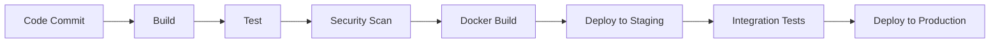

# gayaProdSystem - Technical Architecture

**Author:** BMad Architect Agent
**Date:** 2025-11-12
**Version:** 2.1 - Schema Revision (Material Relationships)

---

## Overview

This document outlines the final technical architecture for gayaProdSystem, a comprehensive enterprise web application for ceramic craft production management. The system transforms artisanal ceramic production from manual processes into a data-driven enterprise platform with real-time tracking, stock management, and multi-user collaboration.

**Foundation**: Built on existing Next.js 16 application with pre-configured production-ready setup.

## System Architecture

### Core Technology Stack

**Frontend & Backend Framework**
- Next.js 16.0.1 (App Router) - Full-stack React framework
- TypeScript 5.6.3 - Type-safe development
- Tailwind CSS 4.0.0 - Utility-first CSS framework

**UI Components & Styling**
- shadcn/ui - Professional component library with Radix UI primitives
- Lucide React - Beautiful icon library
- Next Themes - Dark/light mode support
- React Hook Form + Zod - Form validation with TypeScript schemas

**State Management & Data Fetching**
- TanStack Query (React Query) - Server state management and caching
- NextAuth.js - Complete authentication solution with role-based access

**Database & ORM**
- Prisma 6.19.0 - Type-safe database access
- PostgreSQL - Primary database (migrated from MySQL)

**Real-Time Features**
- Socket.io 4.8.1 - WebSocket implementation for live updates

**Development Tools**
- ESLint - Code quality and consistency
- PostCSS - CSS processing
- TypeScript - Type checking and IntelliSense

### Architecture Benefits

- **Production Ready**: Pre-configured with industry best practices
- **Type Safe**: Full TypeScript coverage with Prisma-generated types
- **Scalable**: Serverless API routes with automatic scaling
- **Real-Time**: WebSocket integration for live production updates
- **Secure**: Role-based authentication with audit trails
- **Maintainable**: Clean architecture with separation of concerns

## Database Architecture

### Prisma Schema Design

The database schema is defined using Prisma ORM with PostgreSQL as the target database. The schema includes migrated legacy tables and new production tracking tables.

#### Core Data Models

**Legacy Product Catalog (Migrated)**
```prisma
model TblcollectMaster {
  id                Int      @id @default(autoincrement())
  collectCode       String   @unique @map("collect_code")
  assemblyCode      String?  @map("assembly_code")
  designCode        String   @map("design_code")
  nameCode          String   @map("name_code")
  categoryCode      String   @map("category_code")
  sizeCode          String   @map("size_code")
  textureCode       String   @map("texture_code")
  colorCode         String   @map("color_code")
  materialCode      String   @map("material_code")
  clientCode        String?  @map("client_code")
  clientDescription String?  @map("client_description")
  collectDate       DateTime? @map("collect_date")
  techDraw          String?  @map("tech_draw")
  photo1            String?  @map("photo1")
  photo2            String?  @map("photo2")
  photo3            String?  @map("photo3")
  photo4            String?  @map("photo4")
  isAssembly        Boolean  @default(false) @map("is_assembly")
  assemblyComponents Json?   @map("assembly_components")
  createdAt         DateTime @default(now()) @map("created_at")
  updatedAt         DateTime @updatedAt @map("updated_at")

  // Relations
  category          TblcollectCategory?
  color             TblcollectColor?
  design            TblcollectDesign?
  material          TblcollectMaterial?
  name              TblcollectName?
  size              TblcollectSize?
  texture           TblcollectTexture?

  // Material relations (flexible one-to-many)
  productClays      ProductClay[]
  productCastings   ProductCasting[]
  productEstruders  ProductEstruder[]
  productTextures   ProductTexture[]
  productTools      ProductTools[]
  productEngobes    ProductEngobe[]
  productStainOxides ProductStainOxide[]
  productLustres    ProductLustre[]
  productGlazes     ProductGlaze[]

  // Production relations
  workPlanAssignments WorkPlanAssignment[]
}
```

**Material & Tool Tables (Migrated with Photos)**
```prisma
model Tblclay {
  id                Int      @id @default(autoincrement())
  clayCode          String   @unique @map("ClayCode")
  clayDescription   String   @map("ClayDescription")
  clayDate          DateTime @map("ClayDate")
  clayTechDraw      String?  @map("ClayTechDraw")
  clayPhoto1        String?  @map("ClayPhoto1")  // Added photo fields
  clayPhoto2        String?  @map("ClayPhoto2")
  clayPhoto3        String?  @map("ClayPhoto3")
  clayPhoto4        String?  @map("ClayPhoto4")
  clayNotes         String?  @map("ClayNotes")

  productClays      ProductClay[]
}

model Tbltools {
  id                Int      @id @default(autoincrement())
  toolsCode         String   @unique @map("ToolsCode")
  toolsDescription  String   @map("ToolsDescription")
  toolsDate         DateTime @map("ToolsDate")
  toolsTechDraw     String?  @map("ToolsTechDraw")
  toolsPhoto1       String?  @map("ToolsPhoto1")  // Added photo fields
  toolsPhoto2       String?  @map("ToolsPhoto2")
  toolsPhoto3       String?  @map("ToolsPhoto3")
  toolsPhoto4       String?  @map("ToolsPhoto4")
  toolsNotes        String?  @map("ToolsNotes")

  productTools      ProductTools[]
}
```

**Junction Tables (One-to-Many Migration)**
```prisma
model ProductClay {
  id          Int      @id @default(autoincrement())
  collectCode String   @map("collect_code")
  clayId      Int      @map("clay_id")
  sequence    Int?     // 1-4 for legacy compatibility
  quantity    Float?   // KG used
  notes       String?  @map("clay_note")
  createdAt   DateTime @default(now()) @map("created_at")

  product     TblcollectMaster @relation(fields: [collectCode], references: [collectCode])
  clay        Tblclay          @relation(fields: [clayId], references: [id])

  @@unique([collectCode, clayId])
  @@map("product_clays")
}

model ProductGlaze {
  id          Int      @id @default(autoincrement())
  collectCode String   @map("collect_code")
  glazeId     Int      @map("glaze_id")
  sequence    Int?     // 1-4 for legacy compatibility
  density     String?  @map("glaze_density") // Density value
  notes       String?  @map("glaze_note")
  createdAt   DateTime @default(now()) @map("created_at")

  product     TblcollectMaster @relation(fields: [collectCode], references: [collectCode])
  glaze       Tblglaze         @relation(fields: [glazeId], references: [id])

  @@unique([collectCode, glazeId])
  @@map("product_glazes")
}
```

**Production Management System**
```prisma
model User {
  id            Int       @id @default(autoincrement())
  username      String    @unique
  passwordHash  String    @map("password_hash")
  email         String?
  role          String    // R&D, Sales, Forming, Glaze, QC, Admin
  subRole       String?   @map("sub_role")
  isActive      Boolean   @default(true) @map("is_active")
  createdAt     DateTime  @default(now()) @map("created_at")
  updatedAt     DateTime  @updatedAt @map("updated_at")

  // Relations
  employees     Employee[]
  purchaseOrders PurchaseOrder[] @relation("CreatedBy")
  workPlans     WorkPlan[] @relation("CreatedBy")
  productionRecaps ProductionRecap[] @relation("RecordedBy")
  qcResults     QcResult[] @relation("InspectedBy")
  revisionTickets RevisionTicket[] @relation("SubmittedBy")
  approvedTickets RevisionTicket[] @relation("ApprovedBy")
  systemLogs    SystemLog[]
  performanceAssessments PerformanceAssessment[] @relation("AssessedBy")
  attendanceRecords AttendanceRecord[] @relation("RecordedBy")
}

model ProductionStage {
  id              Int      @id @default(autoincrement())
  name            String   // Forming, Glaze, QC & Packaging
  code            String   @unique
  sequenceOrder   Int      @map("sequence_order")
  description     String?
  isActive        Boolean  @default(true) @map("is_active")

  workPlanAssignments WorkPlanAssignment[]
}

model WorkPlanAssignment {
  id              Int      @id @default(autoincrement())
  workPlanId      Int      @map("work_plan_id")
  employeeId      Int      @map("employee_id")
  productionStageId Int    @map("production_stage_id")
  collectCode     String   @map("collect_code")
  plannedQuantity Int      @map("planned_quantity")
  targetQuantity  Int?     @map("target_quantity")
  processName     String?  @map("process_name")
  dayOfWeek       Int      @map("day_of_week")
  isOvertime      Boolean  @default(false) @map("is_overtime")
  notes           String?
  createdAt       DateTime @default(now()) @map("created_at")

  workPlan        WorkPlan
  employee        Employee
  productionStage ProductionStage
  product         TblcollectMaster @relation(fields: [collectCode], references: [collectCode])
  productionRecaps ProductionRecap[]
}

model ProductionRecap {
  id                    Int       @id @default(autoincrement())
  workPlanAssignmentId  Int       @map("work_plan_assignment_id")
  recapDate             DateTime  @map("recap_date")
  actualQuantity        Int       @map("actual_quantity")
  goodQuantity          Int?
  rejectQuantity        Int       @default(0) @map("reject_quantity")
  reFireQuantity        Int       @default(0) @map("re_fire_quantity")
  secondQualityQuantity Int       @default(0) @map("second_quality_quantity")
  notes                 String?
  recordedBy            Int       @map("recorded_by")
  recordedAt            DateTime  @default(now()) @map("recorded_at")

  workPlanAssignment    WorkPlanAssignment @relation(fields: [workPlanAssignmentId], references: [id])
  recorder              User                @relation("RecordedBy", fields: [recordedBy], references: [id])
  qcResults             QcResult[]
}

model QcResult {
  id                    Int       @id @default(autoincrement())
  productionRecapsId    Int       @map("production_recaps_id")
  poNumber              String?   @map("po_number")
  collectCode           String    @map("collect_code")
  qcStage               String    @map("qc_stage")
  goodQuantity          Int       @default(0) @map("good_quantity")
  reFireQuantity        Int       @default(0) @map("re_fire_quantity")
  rejectQuantity        Int       @default(0) @map("reject_quantity")
  secondQualityQuantity Int       @default(0) @map("second_quality_quantity")
  qcNotes               String?   @map("qc_notes")
  inspectedBy           Int       @map("inspected_by")
  inspectedAt           DateTime  @default(now()) @map("inspected_at")

  productionRecap       ProductionRecap @relation(fields: [productionRecapsId], references: [id])
  inspector             User            @relation("InspectedBy", fields: [inspectedBy], references: [id])
  stockItems            StockItem[]
}

model StockItem {
  id                    Int       @id @default(autoincrement())
  qcResultId            Int       @map("qc_result_id")
  collectCode           String    @map("collect_code")
  poNumber              String?   @map("po_number")
  quantity              Int
  grade                 String    @map("grade")
  unitCost              Float?    @map("unit_cost")
  sellingPrice          Float?    @map("selling_price")
  status                String    @default("available") @map("status")
  location              String?
  notes                 String?
  createdAt             DateTime  @default(now()) @map("created_at")

  qcResult              QcResult  @relation(fields: [qcResultId], references: [id])
}
```

### Database Migration Strategy

**Material Relationship Migration Challenge:**
The original MySQL schema used rigid 4-field relationships (Clay1, Clay2, Clay3, Clay4) in `tblcollect_master`. The new PostgreSQL schema implements flexible one-to-many relationships using junction tables.

**Migration Approach:**
1. **Phase 1**: Migrate core tables (tblcollect_master, reference tables) to PostgreSQL
2. **Phase 2**: Migrate material/tool tables (tblclay, tblglaze, tbltools, etc.) with added photo fields
3. **Phase 3**: Transform rigid relationships to junction tables:
   - Extract Clay1-4 IDs → ProductClay junction records
   - Extract Glaze1-4 IDs → ProductGlaze junction records
   - Extract Tools1-4 IDs → ProductTools junction records
   - Extract all other material relationships
4. **Phase 4**: Implement new production tracking tables
5. **Phase 5**: Data validation and integrity checks
6. **Phase 6**: Performance optimization with indexes

**Data Synchronization:**
- **Legacy Compatibility**: Junction tables maintain sequence numbers (1-4) for backward compatibility
- **Quantity Tracking**: Clay relationships include KG quantities
- **Notes Preservation**: Material-specific notes migrated to junction tables
- **Photo Fields**: Added to tbltools, tblcasting, tbltexture, tblestruder tables

## API Architecture

### Next.js App Router API Routes

The application uses Next.js 16 App Router for API endpoints with RESTful conventions:

**Authentication & Users**
```
GET    /api/auth/[...nextauth]     # NextAuth.js handlers
POST   /api/auth/[...nextauth]
```

**Production Management**
```
GET    /api/production/stages       # Production stages
GET    /api/production/work-plans  # Work plan management
POST   /api/production/recaps      # Daily production recording
GET    /api/production/recaps      # Production history
```

**Quality Control**
```
GET    /api/qc/results             # QC results by PO/stage
POST   /api/qc/results             # Record QC inspections
```

**Stock Management**
```
GET    /api/stock/items            # Stock availability
POST   /api/stock/adjustments      # Stock adjustments
```

**Business Entities**
```
GET    /api/clients                # Client management
POST   /api/purchase-orders        # PO creation/management
GET    /api/collections            # Product catalog
```

### Data Fetching with TanStack Query

**Client-side Implementation:**
```typescript
// src/lib/hooks/useProduction.ts
import { useQuery, useMutation } from '@tanstack/react-query';

export function useProductionRecaps(poNumber?: string) {
  return useQuery({
    queryKey: ['production-recaps', poNumber],
    queryFn: () => fetch(`/api/production/recaps?po=${poNumber}`),
    staleTime: 30000, // 30 seconds
  });
}

export function useCreateRecap() {
  return useMutation({
    mutationFn: (data) => fetch('/api/production/recaps', {
      method: 'POST',
      body: JSON.stringify(data),
    }),
    onSuccess: () => {
      queryClient.invalidateQueries({ queryKey: ['production-recaps'] });
    },
  });
}
```

## Real-Time Architecture

### Socket.io Integration

**Server Implementation** (`app/src/pages/api/socket.ts`):
```typescript
import { Server as ServerIO } from 'socket.io';
import { Server as NetServer } from 'http';

export default function handler(req, res) {
  if (res.socket?.server?.io) {
    console.log('Socket.io already running');
    res.end();
    return;
  }

  const httpServer: NetServer = res.socket.server;
  const io = new ServerIO(httpServer, {
    path: '/api/socket',
    addTrailingSlash: false,
  });

  io.on('connection', (socket) => {
    socket.join('production-updates');

    socket.on('subscribe-production', (poNumber: string) => {
      socket.join(`po-${poNumber}`);
    });

    socket.on('production-update', (data) => {
      io.to('production-updates').emit('production-update', data);
      if (data.poNumber) {
        io.to(`po-${data.poNumber}`).emit('production-update', data);
      }
    });

    socket.on('qc-update', (data) => {
      io.to('production-updates').emit('qc-update', data);
      if (data.poNumber) {
        io.to(`po-${data.poNumber}`).emit('qc-update', data);
      }
    });

    socket.on('stock-update', (data) => {
      io.to('production-updates').emit('stock-update', data);
    });
  });

  res.socket.server.io = io;
  res.end();
}
```

**Client Implementation** (`app/src/hooks/useSocket.ts`):
```typescript
import { io } from 'socket.io-client';
import { useEffect, useRef } from 'react';

export function useSocket() {
  const socketRef = useRef();

  useEffect(() => {
    socketRef.current = io();

    return () => {
      socketRef.current?.disconnect();
    };
  }, []);

  return socketRef.current;
}
```

### Real-Time Features

- **Production Updates**: Live status changes across all clients
- **PO-Specific Notifications**: Targeted updates for relevant stakeholders
- **QC Results**: Real-time quality control feedback
- **Stock Changes**: Automatic inventory updates
- **Performance**: <2 second delivery time for updates

## Security Architecture

### Authentication & Authorization

**NextAuth.js Implementation** (`app/src/lib/auth.ts`):
```typescript
export const authOptions: NextAuthOptions = {
  adapter: PrismaAdapter(prisma),
  providers: [
    CredentialsProvider({
      authorize: async (credentials) => {
        const user = await prisma.user.findUnique({
          where: { username: credentials.username, isActive: true },
          include: { employees: true }
        });

        const isValid = await bcrypt.compare(
          credentials.password,
          user.passwordHash
        );

        return {
          id: user.id.toString(),
          username: user.username,
          role: user.role,        // R&D, Sales, Forming, Glaze, QC, Admin
          subRole: user.subRole,  // Granular permissions
          employee: user.employees[0]
        };
      }
    })
  ],
  session: { strategy: 'jwt' },
  callbacks: {
    jwt: ({ token, user }) => ({ ...token, role: user.role, subRole: user.subRole }),
    session: ({ session, token }) => ({ ...session, user: { ...session.user, ...token } })
  }
};
```

### Data Security

- **Password Security**: bcrypt hashing with salt rounds
- **Database Security**: Prisma ORM prevents SQL injection
- **Session Security**: JWT tokens with secure cookies
- **Audit Trail**: SystemLog table tracks all data changes
- **Input Validation**: TypeScript + Zod schemas for API validation

### Role-Based Access Control

**User Roles & Permissions:**
- **R&D**: Product design, technical specifications
- **Sales**: Client management, order creation
- **Forming**: Production planning, work assignments
- **Glaze**: Quality control, process monitoring
- **QC**: Final inspection, stock categorization
- **Admin**: System administration, user management

**Sub-roles** provide granular permissions within departments.

## File Storage Architecture

### AWS S3 Integration

```
Bucket Structure:
/gayaprod-system/
  ├── collections/
  │   ├── photos/
  │   └── tech-draws/
  ├── employees/
  │   └── photos/
  ├── revisions/
  │   └── attachments/
  └── work-plans/
      └── exports/
```

### File Management

- Pre-signed URLs for secure uploads
- CDN integration for performance
- Automatic thumbnail generation
- Version control for critical documents

## File Structure

### Application Architecture

```
app/
├── src/
│   ├── app/                    # Next.js App Router
│   │   ├── api/                # API routes
│   │   │   └── auth/[...nextauth]/route.ts
│   │   ├── auth/               # Authentication pages
│   │   ├── dashboard/          # Main application
│   │   ├── globals.css         # Global styles
│   │   ├── layout.tsx          # Root layout
│   │   └── page.tsx            # Home page
│   ├── components/             # React components
│   │   ├── ui/                 # Shadcn/UI components
│   │   └── providers.tsx       # Context providers
│   ├── hooks/                  # Custom React hooks
│   ├── lib/                    # Utilities and configurations
│   │   ├── auth.ts             # NextAuth configuration
│   │   ├── prisma.ts           # Database client
│   │   └── utils.ts            # Helper functions
│   ├── types/                  # TypeScript definitions
│   └── pages/api/socket.ts     # Socket.io server
├── prisma/
│   └── schema.prisma           # Database schema
├── public/                     # Static assets
├── package.json                # Dependencies
├── next.config.ts             # Next.js configuration
├── tailwind.config.ts         # Tailwind CSS config
├── components.json            # Shadcn/UI configuration
├── tsconfig.json              # TypeScript configuration
└── eslint.config.mjs          # ESLint configuration
```

## Deployment Architecture

### Vercel Deployment (Recommended)

**Configuration** (`vercel.json`):
```json
{
  "buildCommand": "npm run build",
  "outputDirectory": ".next",
  "framework": "nextjs",
  "functions": {
    "app/api/**/*.ts": {
      "maxDuration": 30
    }
  },
  "regions": ["sin1"],
  "env": {
    "DATABASE_URL": "@gaya-prod-db-url",
    "NEXTAUTH_SECRET": "@nextauth-secret",
    "NEXTAUTH_URL": "@nextauth-url"
  }
}
```

### Database Hosting Options

- **Vercel Postgres**: Managed PostgreSQL with automatic scaling
- **Supabase**: Open-source Firebase alternative with real-time features
- **Railway**: Developer-friendly PostgreSQL hosting
- **AWS RDS**: Enterprise-grade PostgreSQL with high availability

### Production Environment Setup

1. **Database**: PostgreSQL with connection pooling
2. **Environment Variables**:
   ```
   DATABASE_URL=postgresql://...
   NEXTAUTH_SECRET=your-secret-key
   NEXTAUTH_URL=https://your-domain.com
   ```
3. **Build Optimization**: Next.js automatic optimization enabled
4. **CDN**: Vercel global CDN for static assets
5. **Monitoring**: Vercel Analytics and Error tracking

## Scalability Considerations

### Horizontal Scaling

- Stateless API services
- Database read replicas
- CDN for static assets
- Microservices architecture for future growth

### Performance Optimizations

- Database indexing on frequently queried fields
- Query result caching
- Lazy loading for large datasets
- Background job processing for reports

### Monitoring & Alerting

- Application Performance Monitoring (APM)
- Database performance metrics
- Real-time alerting for production issues
- Automated scaling based on load

## Integration Architecture

### Legacy System Integration

- Read-only MySQL access during migration
- API endpoints for existing systems
- Data synchronization jobs
- Validation and reconciliation processes

### Third-Party Integrations

- Email service (SendGrid/Mailgun)
- SMS notifications
- ERP system APIs
- Shipping provider integrations

## Development & Deployment Pipeline

### CI/CD Pipeline



### Environment Strategy
- **Development**: Local development with Docker
- **Staging**: Full environment mirroring production
- **Production**: Highly available with backup and recovery

## Risk Mitigation

### Technical Risks
- Database migration: Comprehensive testing and rollback plans
- Real-time performance: Load testing and optimization
- Legacy integration: API versioning and compatibility layers

### Operational Risks
- Single points of failure: Redundant systems and failover
- Data loss: Automated backups and disaster recovery
- Security breaches: Regular audits and penetration testing

## Performance & Scalability

### Performance Optimizations

- **Next.js App Router**: Automatic code splitting and server components
- **React Query**: Intelligent caching with 30-second stale time for production data
- **Database Indexing**: Optimized queries for production tracking and reporting
- **Real-time Efficiency**: Socket.io room-based broadcasting prevents unnecessary updates
- **PWA Features**: Service worker for offline capability and faster subsequent loads

### Scalability Considerations

- **Horizontal Scaling**: Stateless API routes support multiple instances
- **Database Scaling**: PostgreSQL with read replicas for high-traffic periods
- **CDN Integration**: Global content delivery for static assets
- **Caching Strategy**: Multi-layer caching (browser, CDN, server, database)

## Success Metrics

### Performance Targets
- **API Response Time**: <200ms for 95% of requests
- **Real-time Updates**: <2 seconds delivery time
- **Concurrent Users**: 500+ simultaneous WebSocket connections
- **Database Queries**: <3 seconds for complex production reports
- **Page Load**: <3 seconds initial load time

### Reliability Targets
- **Uptime**: 99.9% during business hours (Vercel SLA)
- **Data Accuracy**: 100% audit trail with SystemLog table
- **Backup Recovery**: <4 hours RTO, <1 hour RPO
- **Real-time Reliability**: <0.1% message loss rate

## Implementation Roadmap

### Phase 1: Foundation (Current)
- ✅ Database schema with Prisma
- ✅ Authentication with NextAuth.js
- ✅ Real-time architecture with Socket.io
- ✅ UI components with Shadcn/UI

### Phase 2: Core Features
- Production workflow management
- Quality control system
- Stock management with automatic grading
- Client and PO management

### Phase 3: Advanced Features
- Public catalog with no-login access
- Performance analytics and reporting
- Mobile PWA optimization
- Integration with existing systems

### Phase 4: Enterprise Features
- Advanced analytics dashboard
- Automated alerts and notifications
- ERP system integrations
- Multi-language support

---

## Conclusion

This final architecture document establishes gayaProdSystem as a modern, scalable enterprise platform that transforms artisanal ceramic production into a data-driven operation. Built on your existing Next.js foundation with collaborative architectural decisions, the system supports:

- **Complete Production Workflow**: From R&D to final packaging with real-time tracking
- **Multi-User Collaboration**: Role-based access with live updates across departments
- **Quality Assurance**: Automated QC processes with stock grading
- **Business Intelligence**: Comprehensive reporting and analytics
- **Scalability**: Vercel deployment with global CDN and database optimization

The architecture balances technical excellence with practical implementation, ensuring the system can grow with your business while maintaining the performance and reliability required for ceramic production operations.

**Next Steps**: Begin development with the dashboard and production management modules, using this document as the technical blueprint for all implementation decisions.